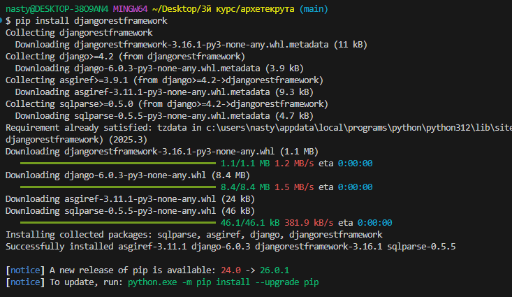
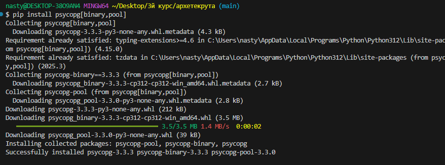
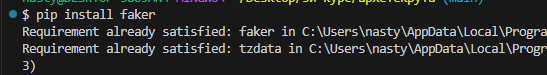
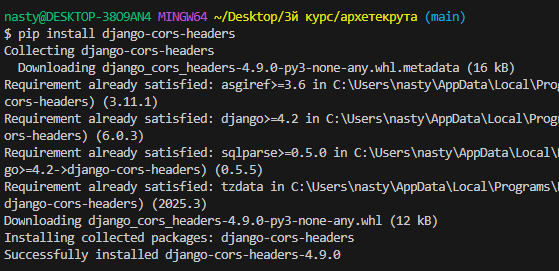
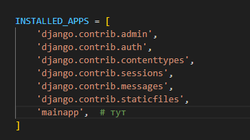
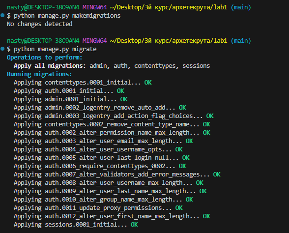
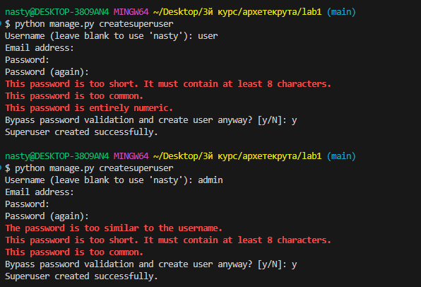
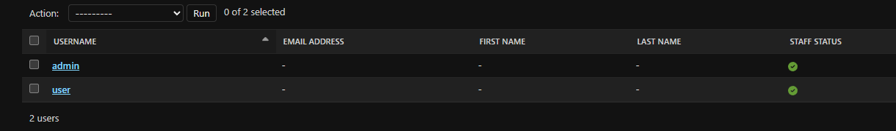

# Лабораторная работа №1

## Ход выполнения работы

---

### 1. Установка Python

Установить версию Python **на 1–2 релиза ниже** текущего последнего.


---

### 2. Установка пакетов PyPI

| № | Команда |
|---|---------|
| 1 | `pip install djangorestframework` |
| 2 | `pip install psycopg[binary,pool]` |
| 3 | `pip install faker` |
| 4 | `pip install gunicorn` |
| 5 | `pip install django-filter` |
| 6 | `pip install django-cors-headers` |

**1) `pip install djangorestframework`**



**2) `pip install psycopg[binary,pool]`**



**3) `pip install faker`** *(уже был установлен)*



**4) `pip install gunicorn`**


**5) `pip install django-filter`**


**6) `pip install django-cors-headers`**



---

### 3. Создание проекта и приложения 




Законспектировать (кратко описать) определения, понятия и структуру проекта.
```
lab1/
├── images/ # изображения для документации lb1.md
│
├── lab1/ # основной конфигурационный пакет 
│ ├── init.py # зависимости 
│ ├── asgi.py # точка входа ASGI (для асинхронных серверов)
│ ├── settings.py # настройки проекта 
│ ├── urls.py # роуты 
│ └── wsgi.py # точка входа WSGI (для веб-серверов)
│
├── mainapp/ # основное приложение 
│ ├── migrations/ # файлы миграций бд
│ ├── init.py # зависимости 
│ ├── admin.py # админ панель
│ ├── apps.py # конфигурация приложения
│ ├── models.py # модели данных (ORM)
│ ├── tests.py # тест кейсы 
│ └── views.py # обработчики HTTP запросов
│
├── lb1.md # отчёт по лабораторной
│
└── manage.py # CLI инструмент управления проектом
```
### Создать скрипты миграции данных и применить их к базе:


### Создать хотя бы одного пользователя (заодно - администратора).


