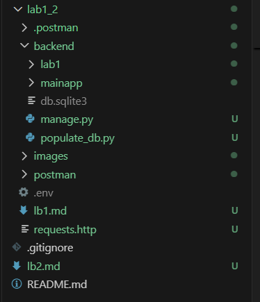

# Лабораторная работа №2

## Ход выполнения работы

---

### 1. Реструктуризация каталогов

Создали подкаталог `backend/` и перенесли туда все файлы Django-проекта из ЛР1:
`manage.py`, пакет `lab1/`, приложение `mainapp/`, скрипт `populate_db.py`.

```
lab1_2/
├── backend/          # Django-проект (перенесён сюда)
│   ├── lab1/
│   ├── mainapp/
│   └── manage.py
├── nginx/            # конфигурация Nginx
└── docker-compose.yaml
```



---

### 2. Создание `backend/requirements.txt`

Перечислены все PyPI-пакеты, необходимые для работы приложения. Docker установит их при сборке образа командой `pip install -r requirements.txt`.

```
django
djangorestframework
psycopg[binary,pool]
python-dotenv
django-cors-headers
gunicorn
faker
```

---

### 3. Обновление `backend/lab1/settings.py`

Внесены три изменения для корректной работы в Docker-окружении:

**`ALLOWED_HOSTS`** — разрешены запросы с любых хостов (внутри Docker запросы приходят от Nginx под именем сервиса):
```python
ALLOWED_HOSTS = ['*']
```

**`STATIC_ROOT`** — добавлен путь для сбора статических файлов Django (CSS/JS admin-панели). Nginx будет отдавать их напрямую из этой папки:
```python
STATIC_URL = 'static/'
STATIC_ROOT = '/staticfiles'
```

**`DATABASES`** — переменные окружения приведены в соответствие с `.env`:
```python
DATABASES = {
    'default': {
        'ENGINE': 'django.db.backends.postgresql',
        'NAME': os.getenv('POSTGRES_DB'),
        'USER': os.getenv('POSTGRES_USER'),
        'PASSWORD': os.getenv('POSTGRES_PASSWORD'),
        'HOST': os.getenv('DB_HOST', 'localhost'),
        'PORT': os.getenv('DB_PORT', '5432'),
    }
}
```

---

### 4. Обновление `.env`

Добавлены переменные `POSTGRES_*`, которые официальный Docker-образ PostgreSQL использует для автоматического создания базы данных при первом запуске. `DB_HOST` изменён на имя сервиса в Docker-сети:

---

### 5. Написание `backend/Dockerfile`

```dockerfile
FROM python:3.12-slim

ENV PYTHONDONTWRITEBYTECODE=1
ENV PYTHONUNBUFFERED=1

WORKDIR /app

COPY requirements.txt .
RUN pip install --no-cache-dir -r requirements.txt

COPY . .
```

| Инструкция | Назначение |
|---|---|
| `FROM python:3.12-slim` | Минимальный образ Python без лишних системных пакетов |
| `PYTHONDONTWRITEBYTECODE=1` | Отключает создание `.pyc`-файлов |
| `PYTHONUNBUFFERED=1` | Логи выводятся в `docker logs` без буферизации |
| `WORKDIR /app` | Рабочая директория внутри контейнера |
| `COPY requirements.txt` перед `COPY . .` | Docker кэширует слои — pip не перезапускается, если код изменился, но зависимости нет |

---

### 6. Написание `docker-compose.yaml`

```yaml
services:
  postgres-service:
    image: postgres:16
    env_file: .env
    volumes:
      - postgres_data:/var/lib/postgresql/data
    healthcheck:
      test: ["CMD-SHELL", "pg_isready -U $${POSTGRES_USER} -d $${POSTGRES_DB}"]
      interval: 5s
      timeout: 5s
      retries: 5

  backend-service:
    build: ./backend
    env_file: .env
    volumes:
      - static_files:/staticfiles
    command: >
      sh -c "python manage.py migrate &&
             python manage.py collectstatic --noinput &&
             gunicorn lab1.wsgi:application --bind 0.0.0.0:8000"
    depends_on:
      postgres-service:
        condition: service_healthy

  nginx-service:
    build: ./nginx
    ports:
      - "80:80"
    volumes:
      - static_files:/static
    depends_on:
      - backend-service

volumes:
  postgres_data:
  static_files:
```

| Сервис | Назначение |
|---|---|
| `postgres-service` | База данных PostgreSQL. `healthcheck` гарантирует, что база готова до старта backend |
| `backend-service` | Django + gunicorn. При запуске накатывает миграции и собирает статику |
| `nginx-service` | Обратный прокси. Принимает запросы на порту 80, проксирует на Django или отдаёт статику |
| `static_files` | Общий том между backend (пишет) и nginx (читает) |

---

### 7. Создание `nginx/templates/default.conf.template`

```nginx
server {
    listen 80;
    server_name _;

    include /etc/nginx/mime.types;
    sendfile on;
    charset utf8;
    autoindex off;

    location = /favicon.ico { access_log off; log_not_found off; }

    location ~ ^/(admin|api)/?(.*)$ {
        proxy_pass http://backend-service:8000;
        proxy_set_header Host $host;
    }

    location /static {
        alias /static;
    }
}
```

Nginx выступает единой точкой входа:
- `/admin`, `/api` → проксируются на Django (порт 8000 внутри Docker-сети)
- `/static` → файлы отдаются напрямую из тома, без обращения к Python

---

### 8. Написание `nginx/Dockerfile`

```dockerfile
FROM nginx:stable-alpine

RUN rm /etc/nginx/conf.d/default.conf

COPY templates /etc/nginx/templates
```

Официальный образ Nginx автоматически обрабатывает `.template`-файлы из папки `/etc/nginx/templates` и создаёт рабочие конфиги при старте контейнера.

---

### 9. Запуск и проверка

```bash
docker compose up --build
```

**Проверка работы API на порту 80:**


**Проверка Django admin-панели:**


