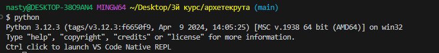
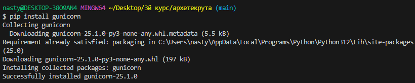
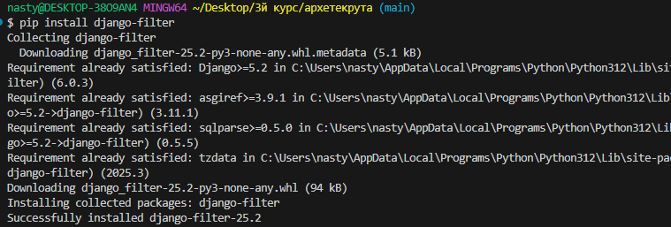
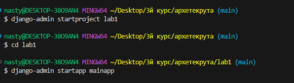

## Ход выполенения работы Лабороторной №1 

### 1. Установка Python

Установить версию Python **на 1–2 релиза ниже** текущего последнего.

### 2. Установка пакетов PyPI
1) pip install djangorestframework

2) pip install psycopg[binary,pool]
 

3) pip install faker (уже был )

4) pip install gunicorn

5) pip install django-filter 

6) pip install django-cors-headers

### 3. Создание проекта и приложения Django

